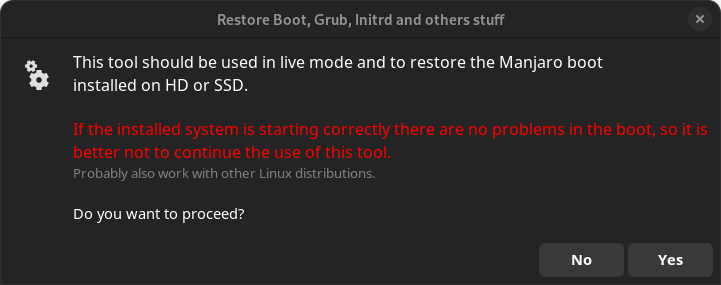
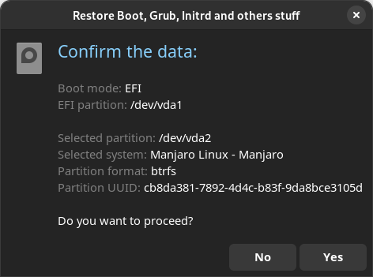
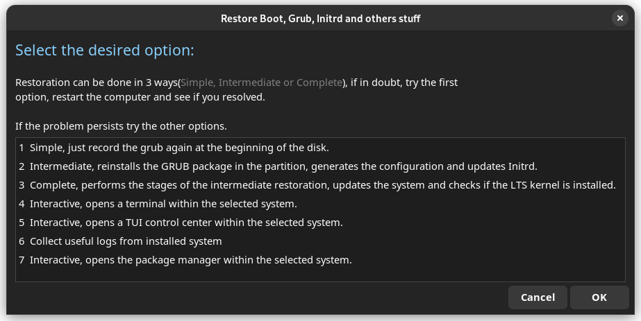

# Manjaro Rescue
*( Thank you at biglinux devs for the idea )*

Tool to be used in live mode that automates the restoration of Grub, reinstallation of the Kernel, access to the terminal via chroot, grab a logs from installed system and other options to perform maintenance on the system installed from the live mode.

